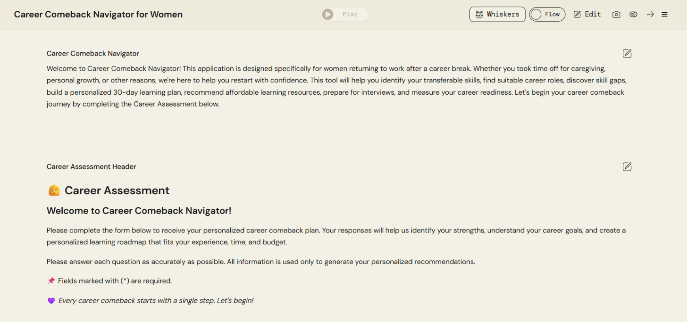
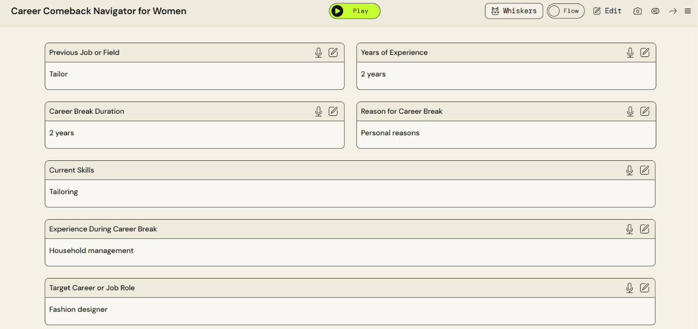
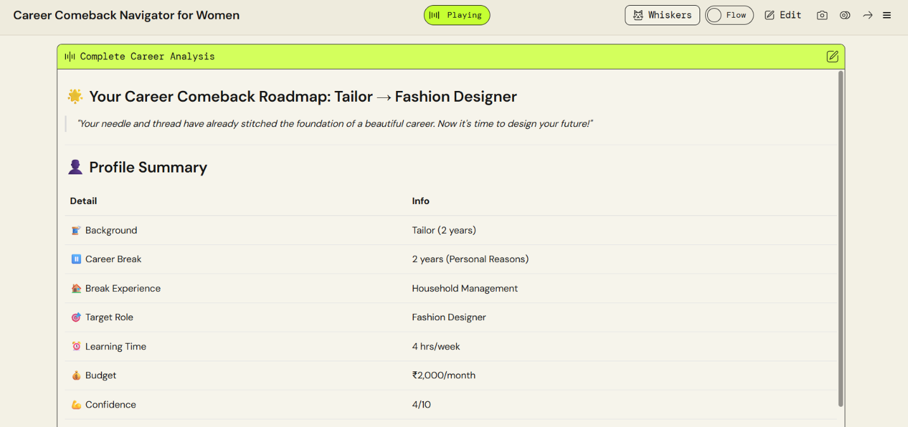
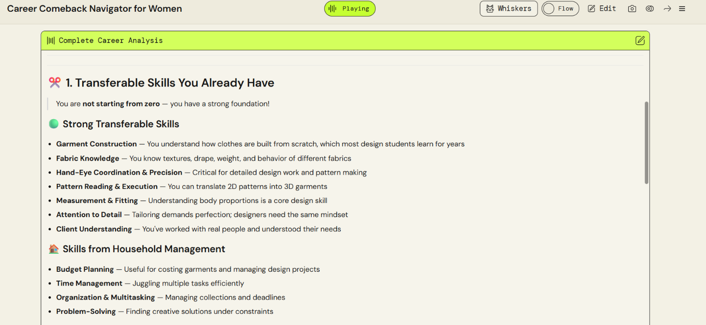
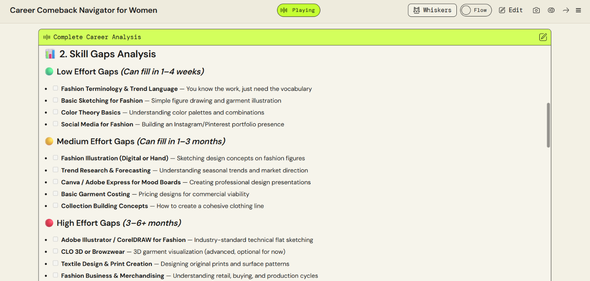
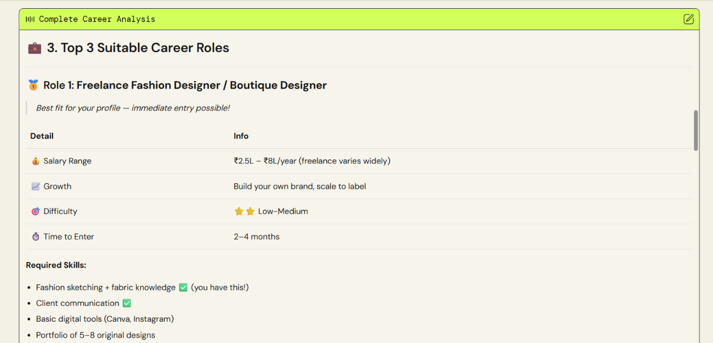
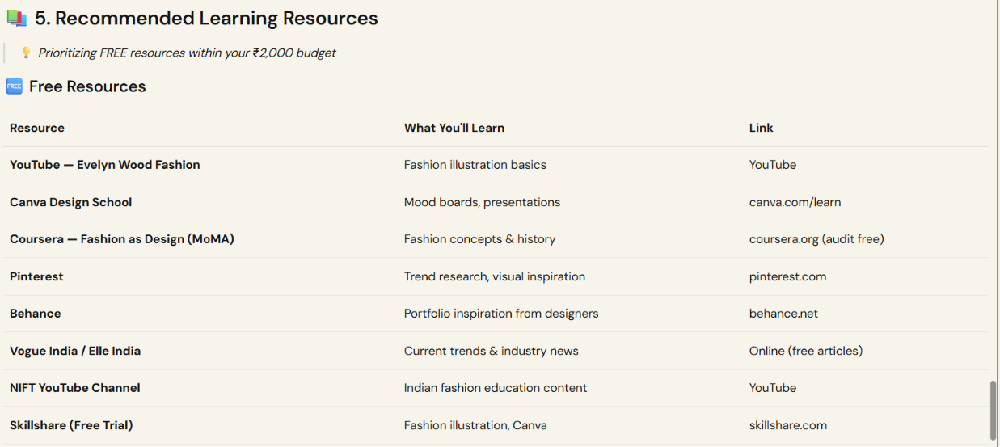
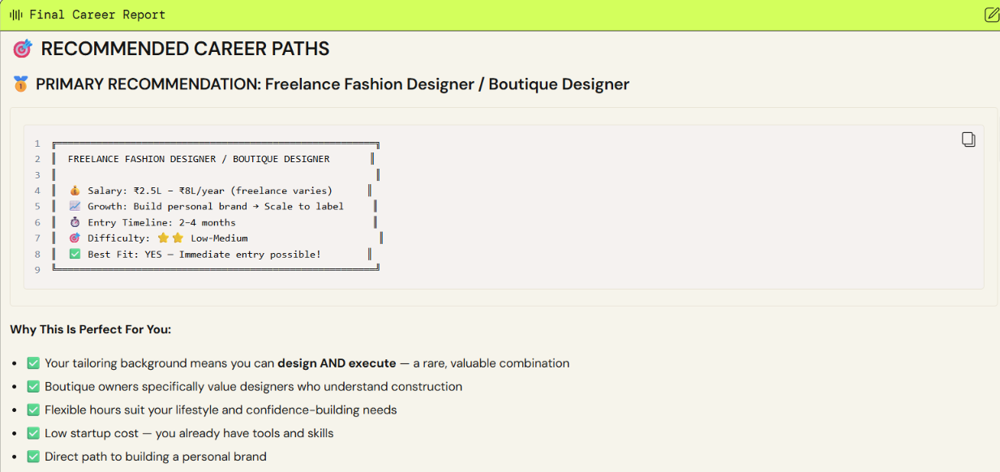

# 🌸 Career Comeback Navigator for Women

> A Generative AI-powered career guidance application designed to help women restart their professional journey after a career break.

## 📌 Project Overview

**Career Comeback Navigator for Women** is a Generative AI application built using **AWS PartyRock**.

The application is designed specifically for women returning to work after a career break due to caregiving, personal reasons, family responsibilities, or other circumstances.

Instead of providing generic career advice, the application analyzes the user's:

- Previous job or field
- Years of experience
- Career break duration
- Reason for the career break
- Current skills
- Experience gained during the career break
- Target career or job role
- Available learning time
- Learning budget
- Confidence level

Based on this information, it generates a personalized **Career Comeback Roadmap**.

---

## 🎯 Problem Statement

Returning to work after a career break can be challenging.

Women may face difficulties such as:

- Identifying transferable skills from previous experience
- Understanding current skill requirements
- Finding suitable career roles
- Identifying skill gaps
- Deciding what to learn and where to learn it
- Managing learning within a limited time and budget
- Preparing for a structured career comeback

There is a need for an accessible and personalized solution that can guide users through these challenges.

---

## 💡 Proposed Solution

**Career Comeback Navigator** uses Generative AI to analyze a user's career profile and generate a personalized career comeback plan.

The application identifies existing strengths, analyzes skill gaps, suggests suitable career paths, recommends learning resources, and provides a structured roadmap for returning to work.

---

## ✨ Key Features

### 1. 📝 Career Assessment

The user provides information about their professional background, career break, skills, experience, target role, learning time, budget, and confidence level.

### 2. ✂️ Transferable Skills Analysis

The application identifies skills that the user already possesses and explains how those skills can be useful in their target career.

Examples include:

- Attention to detail
- Time management
- Budget planning
- Organization
- Problem solving
- Client understanding
- Pattern execution
- Fabric knowledge

### 3. 📊 Skill Gap Analysis

The application categorizes the skills that need to be developed into:

- 🟢 Low Effort Gaps
- 🟡 Medium Effort Gaps
- 🔴 High Effort Gaps

It also provides estimated time ranges for developing these skills.

### 4. 💼 Career Role Recommendations

The application identifies suitable career roles based on the user's existing skills, experience, target role, and skill gaps.

The recommendations can include:

- Salary range
- Growth opportunities
- Required skills
- Difficulty level
- Estimated entry time
- Fit with the user's existing experience

### 5. 📚 Learning Resource Recommendations

The application recommends learning resources according to the user's available budget.

Examples include:

- YouTube
- Canva Design School
- Coursera
- Pinterest
- Behance
- Vogue India / Elle India
- NIFT learning content

### 6. 🗺️ Personalized Career Comeback Roadmap

The application combines the assessment results into a personalized roadmap.

It connects the user's existing background with their target career and provides actionable guidance for moving forward.

### 7. 📋 Final Career Report

The application generates a final career report containing recommended career paths and personalized guidance based on the user's assessment.

---

## 🤖 AI Technology

### Generative AI

Generative AI is used to analyze the information provided by the user and generate personalized career guidance.

The AI transforms the user's career background, existing skills, career-break experience, goals, available time, and budget into structured recommendations.

### AWS PartyRock

The application was created and deployed using **AWS PartyRock**, a platform for building Generative AI applications.

### Prompt Engineering

Prompts are designed to guide the AI to produce structured outputs such as:

- Transferable skills
- Skill gaps
- Career recommendations
- Learning resources
- Career roadmap
- Final career report

---

## 🛠️ Technologies Used

| Technology | Purpose |
|---|---|
| AWS PartyRock | Building and hosting the Generative AI application |
| Generative AI | Personalized career analysis and recommendations |
| Prompt Engineering | Designing structured AI responses |

---

## ⚙️ How It Works

```text
                USER
                  │
                  ▼
        ┌───────────────────┐
        │ Career Assessment │
        └─────────┬─────────┘
                  │
                  ▼
        ┌───────────────────┐
        │ Profile Analysis  │
        └─────────┬─────────┘
                  │
        ┌─────────┴─────────┐
        ▼                   ▼
Transferable Skills    Skill Gap Analysis
        │                   │
        └─────────┬─────────┘
                  ▼
        Career Role Recommendations
                  │
                  ▼
        Learning Resources
                  │
                  ▼
        Career Comeback Roadmap
                  │
                  ▼
          Final Career Report
---

## 📸 Application Screenshots

### 🏠 Career Comeback Navigator


### 📝 Career Assessment


### 👤 Career Profile


### ✂️ Transferable Skills Analysis


### 📊 Skill Gap Analysis


### 💼 Career Role Recommendations


### 📚 Recommended Learning Resources


### 📋 Final Career Report


---

## 🚀 Live Demo

Try the application here:

[Career Comeback Navigator for Women](https://partyrock.aws/u/harini417/uYzVDk373/Career-Comeback-Navigator-for-Women)

---

## 🎯 Project Objectives

- Help women identify their existing and transferable skills
- Identify relevant skill gaps after a career break
- Suggest suitable career opportunities
- Recommend learning resources based on time and budget
- Provide a structured career comeback roadmap
- Support a personalized return-to-work journey

---

## 👩‍💻 Target Users

- Women returning to work after a career break
- Professionals restarting their careers
- Individuals looking to transition into a new career
- People who need personalized learning and career guidance

---

## 🔮 Future Enhancements

- Resume generation based on the recommended career path
- Job matching and job opportunity suggestions
- Interview preparation
- Personalized weekly learning plans
- Progress tracking
- Integration with career and learning platforms

---

## 🌟 Project Highlights

- Built using **AWS PartyRock**
- Uses **Generative AI**
- Uses **Prompt Engineering**
- Provides personalized career guidance
- Focuses on career re-entry after a break
- Converts user information into a structured career roadmap

---

## 👩‍💻 Author

**Harini M**  
Computer Science and Engineering Student
